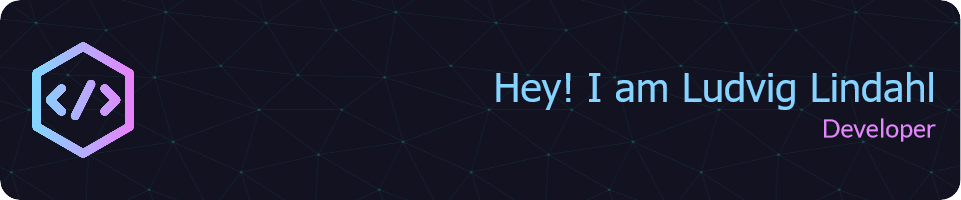

## :notebook: About me
Hello! I am currently studying towards a Master in Computer Science. I also has some small code side projects in areas that interests me. 
For now my current project that I try to finish is a portfolio website where I showcase my experience and projects.

## :rocket: Languages & Tools
This is the languages and tools I use the most and have most knowledge about. Click on the icons for links to each language or tool.

 <!-- React -->
 <!-- Java -->
 <!-- Kotlin -->
 <!-- Javascript -->
<!-- TypeScript -->

 <!-- Flutter -->
 <!-- Dart -->

<!-- MySql -->
 <!-- Postgresql -->
### Tools

<!-- VS Code -->
<!-- Intellij -->
 <!-- Android Studio -->

 <!-- Git -->
 <!-- Bash -->

 <!-- Linux -->
 <!-- Windows -->

## :books: Other interests 
:desktop_computer: PC related stuff

:climbing: Climbing

:field_hockey: Field hockey

:tennis: Squash

## Github statistics

## Contact me
 <!-- Gmail -->
